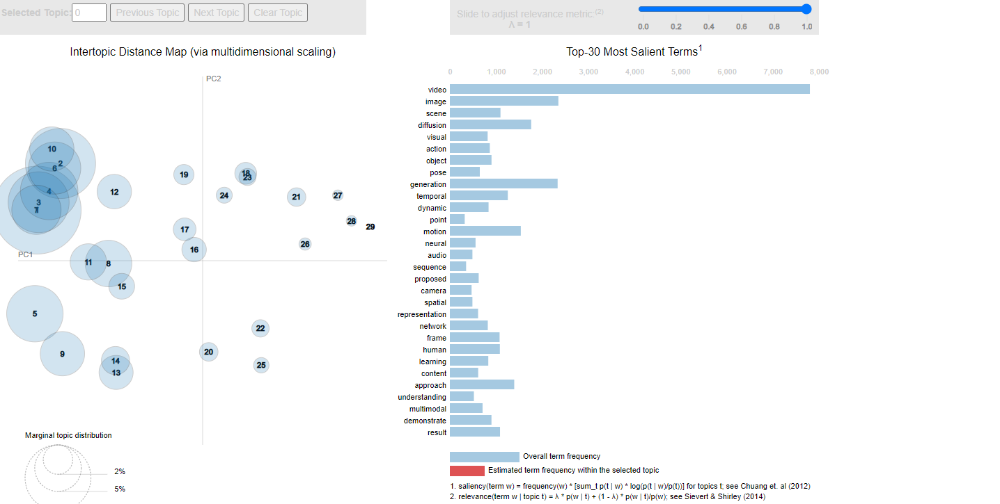

# About the project ***`video_gen_trends_analysis`***

## 📊 Ноутбук с выполненным заданием: [Здесь](src/notebooks/arXiv_video_generation_trends.ipynb)

`src/notebooks/arXiv_video_generation_trends.ipynb`

### Содержание

1. [Описание проекта](#01)
2. [EDA](#02)
3. [Обучение моделей](#03)
   - [Модели регрессии](#031)
   - [Feature engineering](#032)
   - [Метрики](#033)
4. [Разработка веб-сервиса на FastAPI](#04)
5. [Демонстрация работы сервиса `API + Ridge regression model`](#05)

### Описание проекта 

**Цель данного проекта — **

